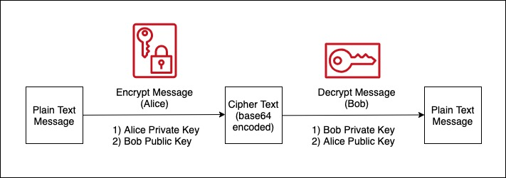

## ethereum-rsa

Encrypt and Decrypt message using **Ethereum keys**. 

### How it works?

- Let's say, `Alice` wants to send secured message to `Bob`. This is How it will work:
1. `Alice` encrypt message using his **privatekey** and **Bob's publickey**.
2. `Alice` sends encrypted message to `Bob`.
3. `Bob` decrypt message using his **privatekey** and **Alice publickey**.

##### Benifits:
- Only `Bob` can read the message
- `Bob` can be sure that the message really comes from `Alice` 

    

